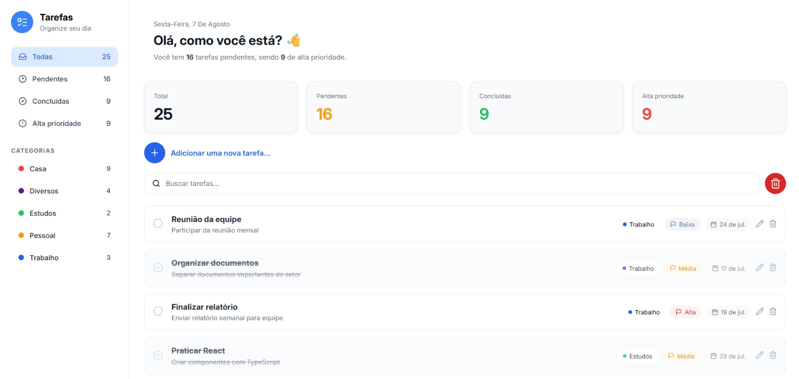
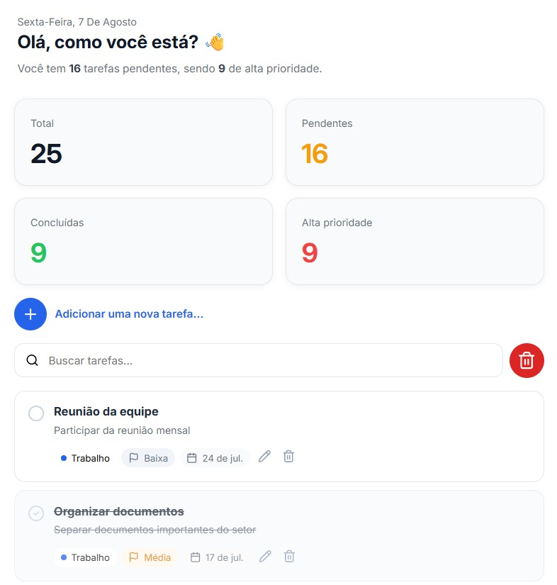
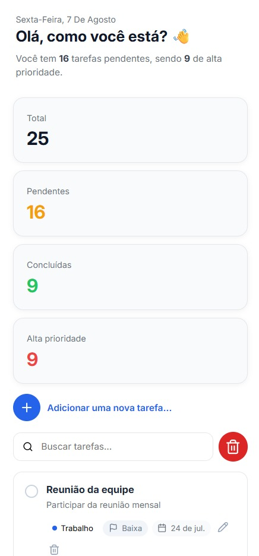
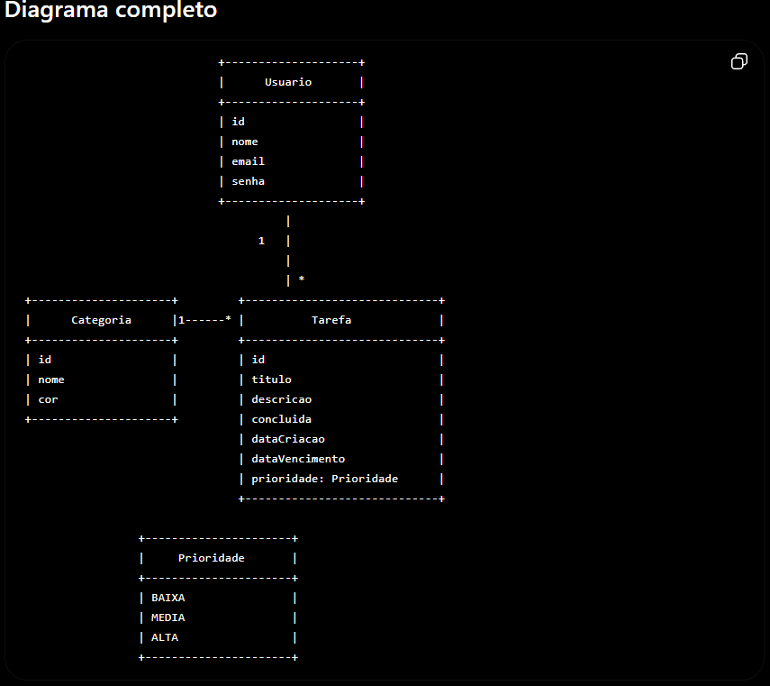

# 📝 TodoList — Gerenciador de Tarefas

[](https://www.oracle.com/java/)
[](https://spring.io/projects/spring-boot)
[](https://spring.io/projects/spring-data-jpa)
[](https://hibernate.org/)
[](https://www.postgresql.org/)
[](https://www.h2database.com/)
[](https://maven.apache.org/)
[](https://junit.org/junit5/)
[](https://swagger.io/)

[](https://react.dev/)
[](https://www.typescriptlang.org/)
[](https://vite.dev/)
[](https://axios-http.com/)
[](https://developer.mozilla.org/en-US/docs/Web/CSS)

[](https://www.docker.com/)
[](https://railway.com/)
[](https://vercel.com/)

[](https://github.com/Marrafon91/todoList)
[](https://www.linkedin.com/in/guilherme-marrafon/)
[](https://todo-list-five-alpha-25.vercel.app/)
[](https://todolist-production-9e3f.up.railway.app/)
[](https://todolist-production-9e3f.up.railway.app/swagger-ui/index.html)

---

## 🌐 Projeto Online

### 🖥️ Aplicação

👉 **[Acessar TodoList](https://todo-list-five-alpha-25.vercel.app/)**


### 📚 Documentação Swagger

👉 **[Acessar Swagger](https://todolist-production-9e3f.up.railway.app/swagger-ui/index.html)**

---

# 📸 Interface

## Desktop



---

## Tablet



---

## Mobile

<p align="center">
  
</p>

---

## Diagrama UML



---

# 🎯 Objetivo

O **TodoList** é uma aplicação Full Stack desenvolvida com o objetivo de consolidar conhecimentos em desenvolvimento de aplicações web utilizando **Java, Spring Boot, React e TypeScript**.

O projeto foi desenvolvido seguindo uma arquitetura baseada em **API REST**, separando o backend e frontend em aplicações independentes.

Além da implementação das funcionalidades, o projeto também teve como objetivo colocar em prática conceitos importantes de desenvolvimento profissional, como:

* Arquitetura REST
* Programação Orientada a Objetos
* Separação de responsabilidades
* DTOs
* Bean Validation
* Tratamento global de exceções
* Persistência de dados
* Testes automatizados
* Documentação de API
* CORS
* Variáveis de ambiente
* Containerização com Docker
* Deploy em produção

---

# 🚀 Funcionalidades

A aplicação permite ao usuário:

* ✅ Cadastro de tarefas
* ✅ Atualização de tarefas
* ✅ Exclusão de tarefas
* ✅ Exclusão de todas as tarefas
* ✅ Marcar tarefas como concluídas
* ✅ Pesquisa por título
* ✅ Filtro por categoria
* ✅ Filtro por prioridade
* ✅ Filtro por status
* ✅ Dashboard com indicadores
* ✅ Sidebar com resumo das tarefas
* ✅ Organização por categorias
* ✅ Definição de prioridade
* ✅ Definição de data de vencimento
* ✅ Interface responsiva
* ✅ Seleção de categorias através de modal
* ✅ Criação de tarefas diretamente pelo frontend

---

# 🏗️ Arquitetura

```text
                         ┌──────────────────────┐
                         │      React 19        │
                         │    TypeScript        │
                         │        Vite          │
                         └──────────┬───────────┘
                                    │
                                  Axios
                                    │
                              HTTP / JSON
                                    │
                                    ▼
                         ┌──────────────────────┐
                         │    Spring Boot 4    │
                         │       REST API       │
                         └──────────┬───────────┘
                                    │
                              Spring Data JPA
                                    │
                               Hibernate
                                    │
                                    ▼
                         ┌──────────────────────┐
                         │     PostgreSQL       │
                         │       Railway        │
                         └──────────────────────┘
```

---

# 📦 Tecnologias

## Backend

* ☕ Java 25
* 🍃 Spring Boot 4.1.0
* Spring Data JPA
* Hibernate
* Bean Validation
* PostgreSQL
* H2 Database
* Maven
* Swagger / OpenAPI
* JUnit 5
* MockMvc
* JaCoCo

## Frontend

* ⚛️ React 19
* TypeScript
* Vite
* Axios
* CSS
* React Router

## Infraestrutura e Deploy

* 🐳 Docker
* 🚂 Railway
* ▲ Vercel
* GitHub

---

# 🗄️ Banco de Dados

## Produção

O banco de dados utilizado em produção é o **PostgreSQL**, hospedado através do Railway.

```text
React
  │
  ▼
Vercel
  │
  ▼
Spring Boot
  │
  ▼
Railway
  │
  ▼
PostgreSQL
```

## Desenvolvimento

Durante o desenvolvimento foram utilizados:

* PostgreSQL
* H2 Database

O H2 também foi utilizado para testes e desenvolvimento local.

---

# 🧪 Testes

O backend possui testes automatizados utilizando:

* JUnit 5
* Spring Boot Test
* MockMvc
* Mockito

Foram implementados testes envolvendo:

* Controllers
* Services
* Repositories

## 📊 Cobertura

* ✅ 75 testes automatizados
* ✅ 99% de cobertura utilizando JaCoCo

---

# 📚 Documentação da API

A API REST foi documentada utilizando **Swagger / OpenAPI**.

### Produção

👉 **[Swagger UI](https://todolist-production-9e3f.up.railway.app/swagger-ui/index.html)**

### Principais endpoints

```text
GET    /api/tasks
GET    /api/tasks/{id}
POST   /api/tasks
PUT    /api/tasks/{id}
DELETE /api/tasks/{id}

GET    /api/categories
GET    /api/categories/{id}
```

---

# 🔐 Configuração

O projeto utiliza variáveis de ambiente para configurações específicas de cada ambiente.

Exemplo:

```properties
spring.datasource.url=${DATABASE_URL}
spring.datasource.username=${DATABASE_USERNAME}
spring.datasource.password=${DATABASE_PASSWORD}

server.port=${PORT:8080}
```

# 🐳 Docker

O backend possui um `Dockerfile` para criação da imagem da aplicação.

Exemplo da estrutura:

```text
back-end/
│
├── Dockerfile
├── pom.xml
├── mvnw
├── mvnw.cmd
└── src/
```

O Docker é utilizado no processo de deploy do backend no Railway.

---

# ▶️ Como executar o projeto

## 1. Clonar o repositório

```bash
git clone https://github.com/Marrafon91/todoList.git
```

```bash
cd todoList
```

---

# ⚙️ Backend

Entre na pasta:

```bash
cd back-end
```

Execute:

```bash
./mvnw spring-boot:run
```

No Windows:

```bash
mvnw.cmd spring-boot:run
```

A API ficará disponível em:

```text
http://localhost:8080
```

Swagger:

```text
http://localhost:8080/swagger-ui/index.html
```

---

# 💻 Frontend

Entre na pasta:

```bash
cd front-end
```

Instale as dependências:

```bash
npm install
```

Execute o projeto:

```bash
npm run dev
```

O frontend será disponibilizado pelo Vite.

Normalmente:

```text
http://localhost:5173
```

---

# 🌐 Deploy

## Frontend — Vercel

O frontend está hospedado gratuitamente na **Vercel**.

👉 **[TodoList — Aplicação Online](https://todo-list-five-alpha-25.vercel.app/)**

```text
https://todo-list-five-alpha-25.vercel.app/
```
---

## Swagger

👉 **[Documentação da API](https://todolist-production-9e3f.up.railway.app/swagger-ui/index.html)**

```text
https://todolist-production-9e3f.up.railway.app/swagger-ui/index.html
```

---

# 📂 Estrutura do Projeto

```text
todoList/
│
├── back-end/
│   │
│   ├── src/
│   │   ├── main/
│   │   │   └── java/
│   │   │       └── io/github/marrafon91/todoList/
│   │   │
│   │   └── test/
│   │
│   ├── Dockerfile
│   ├── pom.xml
│   └── mvnw
│
├── front-end/
│   │
│   ├── src/
│   │   ├── components/
│   │   ├── models/
│   │   ├── pages/
│   │   ├── services/
│   │   └── ...
│   │
│   ├── package.json
│   ├── vite.config.ts
│   └── tsconfig.json
│
├── docs/
│   └── images/
│
├── LICENSE
└── README.md
```

---

# 🔄 Fluxo da Aplicação

```text
Usuário
   │
   ▼
React + TypeScript
   │
   │ Axios
   ▼
Spring Boot REST API
   │
   ├── Controllers
   │
   ├── Services
   │
   ├── DTOs
   │
   ├── Repositories
   │
   └── Entities
   │
   ▼
Hibernate / JPA
   │
   ▼
PostgreSQL
```

---

# 📈 Conhecimentos Aplicados

Durante o desenvolvimento foram aplicados conhecimentos de:

### Backend

* Java
* POO
* Spring Boot
* REST
* Spring Data JPA
* Hibernate
* DTO
* Bean Validation
* Exceptions
* Profiles
* CORS
* PostgreSQL
* H2
* Testes automatizados
* JaCoCo
* Swagger
* Docker

### Frontend

* React
* TypeScript
* Componentização
* Props
* Hooks
* Estados
* React Router
* Axios
* Consumo de API REST
* Tipagem
* Variáveis de ambiente
* Responsividade
* CSS

### Deploy

* GitHub
* Docker
* Railway
* Vercel
* Configuração de variáveis de ambiente
* Deploy contínuo através do GitHub

---

# 👨‍💻 Autor

## Guilherme Marrafon

Desenvolvedor **Full Stack em formação**, com foco no ecossistema **Java e Spring Boot**, estudando também **React e TypeScript** para desenvolvimento de aplicações completas.

### 🔗 Links

[](https://github.com/Marrafon91)

[](https://www.linkedin.com/in/guilherme-marrafon/)

---

# ⭐ Projeto desenvolvido para fins de estudo, prática e evolução profissional.

Se este projeto foi útil ou interessante, considere deixar uma ⭐ no repositório!
